Kevin Turner Sept 2015

Registration
============

Before using the system you must register your details on the system. It can be accessed on your PC, Mac, tablet or smart phone by going to this address in a browser: <http://squareevents.org>

The screenshots here are from an iPhone 6.

The following screen will be displayed:

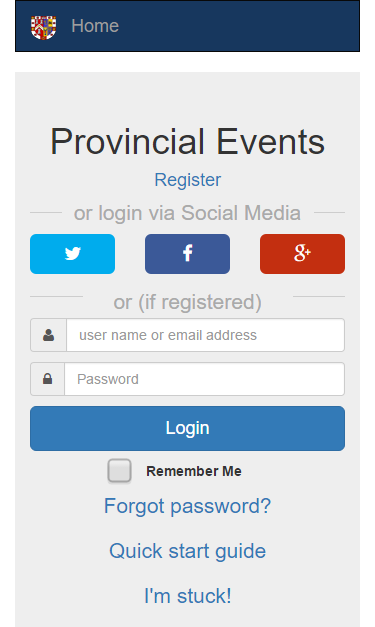{width="3.9057622484689416in" height="6.947048337707787in"}

If you use Social Media regularly, you may find it convenient to register with your Twitter, Facebook or Google account simply by clicking the relevant button and following the instructions. This is known as using a “Social Media passport” Alternatively you can register manually by clicking “**Create an account**”.

The following screen is then shown. You must complete all the fields whose label is flagged with an asterisk. Some fields will be already filled in if you have used a Social Media passport.

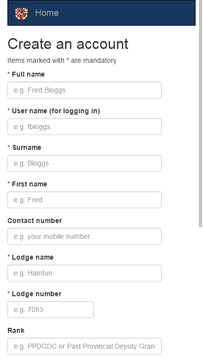{width="2.9791666666666665in" height="5.293081802274716in"}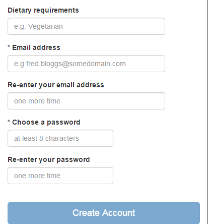{width="2.9261920384951883in" height="3.1458333333333335in"}

*The user name and password field(s) are only shown if you are signing up manually (as opposed to using your Social Media passport).* When all the required fields are complete, you can click or tap the “Create Account” button. Assuming no errors occur, you will then be logged in.

Subsequent access to the system can be obtained by clicking the same social media button that you used to register or, if you signed up manually, by using the user name and password you specified at the time. Non-Social Media user s may also use the “Remember me” option to prevent having to key your details in each time.

### Administrators

Administrators have more functions that ordinary users, such as the ability to edit users, create and administer events, download bookings and manually add bookings to events. If you think you require administrative rights, please email an existing administrator and provide the details you registered with (email address will be suffice).

Booking in
==========

The home screen is presented when you first log in. You can also access it by clicking/tapping the “Book in” text in the top left hand corner. Clicking the provincial logo will take you to the provincial web site. On this screen you will see a list of events that are available.

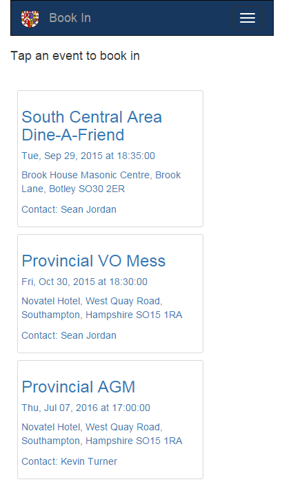{width="4.260416666666667in" height="7.625in"}

Simply tab or click an event to book in. The following screen is displayed:

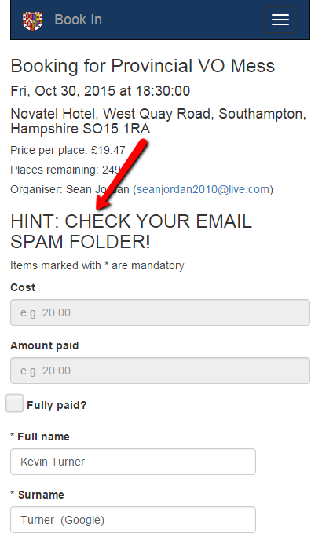{width="2.990832239720035in" height="4.989583333333333in"}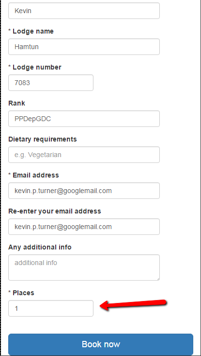{width="2.8541666666666665in" height="5.034337270341207in"}

Simply fill in your details (some will filled in automatically) and click “Book now”.

Pay careful attention to the HINT. ***You will receive email confirmation of your booking with details on how to pay, and when you have to pay by***. If you cannot find the email, check your email Spam/Junk folder, and whitelist the email address for the future.

If you need to book other people in as well as yourself, change the “Places” field to match the number of people required. Some events, like “Dine-a-friend”, will require you to enter a minimum of two people.

Managing your bookings
======================

On small screens there is a menu button in the top right hand corner: {width="0.3854166666666667in" height="0.3229166666666667in"}

On bigger screens the menu is already visible.

This toggles the menu (visible/invisible) and from here you can see the options that are available to you. Click on

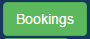{width="0.9375in" height="0.40625in"}

And you will get a list of your bookings:

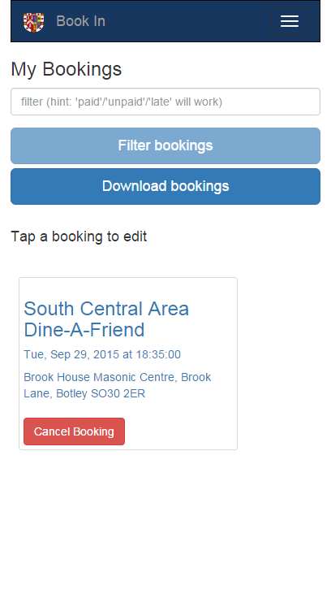{width="2.4791666666666665in" height="4.4418405511811025in"}

Here I only have one booking, but you may have several. You can narrow down the list by keying in filter information (event name, venue etc) or by using special values like “paid” for a list of events you have paid for, “unpaid” for the reverse, “late” for events you are late in paying for.

You can edit your booking by clicking/tapping on it.

You can cancel your booking by clicking “Cancel Booking”.

**NOTE: Unless you are an administrator, you cannot change or cancel bookings that have been flagged as paid.**

The “Download bookings” button will export your bookings (filtered if applicable) into a CSV file that can be loading into MS Excel or used for something like Perfect Table Plan.

Managing your profile
=====================

On small screens there is a menu button in the top right hand corner: {width="0.3854166666666667in" height="0.3229166666666667in"}

On bigger screens the menu is already visible.

This toggles the menu (visible/invisible) and from here you can see the options that are available to you. Click on

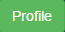{width="0.6770833333333334in" height="0.3333333333333333in"}

This will take you to the same page that you saw when you registered. Here you can edit and save your profile details (i.e. you registered information).

Administering events
====================

***This option is only available to administrators.***

On small screens there is a menu button in the top right hand corner: {width="0.3854166666666667in" height="0.3229166666666667in"}

On bigger screens the menu is already visible.

This toggles the menu (visible/invisible) and from here you can see the options that are available to you. Click on

{width="0.7083333333333334in" height="0.3541666666666667in"}

You will get a list of existing events that you can filter, create, copy, change or delete.

You can also view all the bookings associated with an event, and edit/download those.

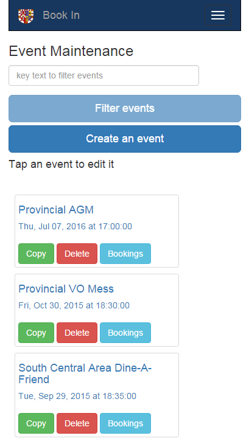{width="3.4791666666666665in" height="6.209759405074366in"}

The event maintenance page looks like this:

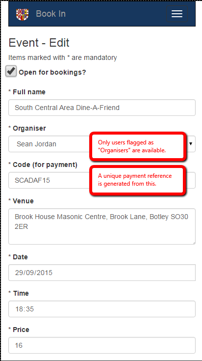{width="2.96875in" height="5.296192038495188in"} 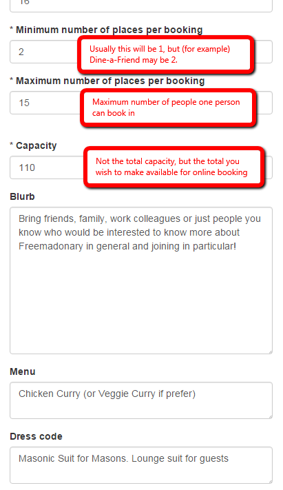{width="3.0833333333333335in" height="5.333941382327209in"}

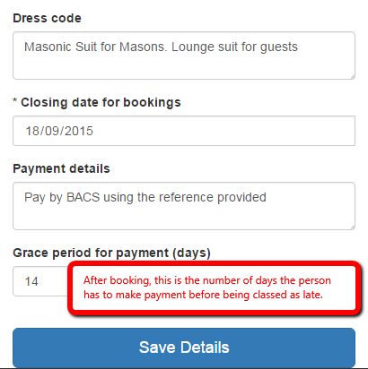{width="3.4791666666666665in" height="3.4961384514435694in"}

Administering users
===================

***This option is only available to administrators.***

On small screens there is a menu button in the top right hand corner: {width="0.3854166666666667in" height="0.3229166666666667in"}

On bigger screens the menu is already visible.

This toggles the menu (visible/invisible) and from here you can see the options that are available to you. Click on

{width="0.6770833333333334in" height="0.375in"}

You will then get a list of the users that you can filter, edit or delete.

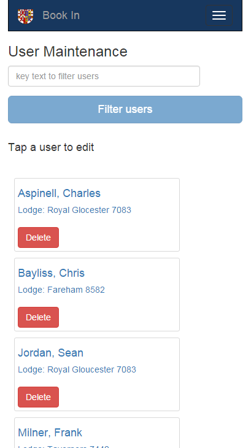{width="3.2395833333333335in" height="5.782141294838145in"}

The user maintenance screen is similar to the profile maintenance screen, but has some extra fields that only administrators can see:

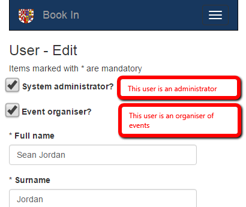{width="3.1979166666666665in" height="2.6909295713035872in"}

Email example
=============

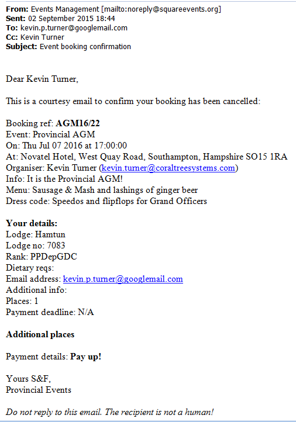{width="5.270833333333333in" height="7.520833333333333in"}
